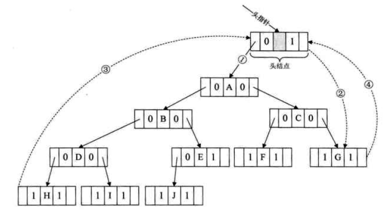

### *1*  树的存储结构
* 双亲表示法
* 孩子表示法（多重链表表示）
* 孩子兄弟表示法

要理解树的存储结构的不同方法逻辑性，知道不同表示法的优缺点问题。

### *2* 二叉树
* 熟记二叉树的5条性质，尤其第4条的推导

    性质1：在二叉树的第i层上至多有2^(i-1)个结点。
    
    性质2： 深度为k的二叉树至多有（2^k）-1个结点，最多的情况下即是满二叉树。
    
    性质4：具有n个结点的完全二叉树的深度为[logn]+1.(由满二叉树的定义，深度为k的满二叉树的结点数n一定(2^k)-1. 反推即可）
    
* 二叉树存储结构表示

    1.顺序存储
    
    2.二叉、三叉链表

### *3* 遍历二叉树
 * 前中后序
 * 二叉树遍历性质
    
    1. 已知`前序和中序`遍历序列，唯一确定一棵二叉树.
    2. 已知`后序和中序`，唯一确定一棵二叉树。
### *4* 二叉树构建

### *5* 线索二叉树
   
  调整后线索二叉树
  
   

### *6* 树、森林与二叉树的转换
   * 树遍历
   
     1.先根遍历树，即先访问树的根节点，再依次先根遍历根的每棵子树。
     
     2.后根遍历。
    
   * 森林遍历
   
     1.前序遍历：先访问森立第一棵树根节点，再依次先根遍历根的每棵子树，再同样的方式遍历剩余树。
       
     2.后序遍历：先访第一棵树，后根遍历，其他剩余树类似。
     
   * 结论
   
     1.森林的前序遍历与二叉树的前序遍历结果相同；森林后序遍历与二叉树中序遍历结果相同。
     
     2.以二叉链表作为树的存储结构时，树的先根遍历和后根遍历完全可以借助二叉树的前序遍历的算法来实现。

### *7* 赫夫曼树及其应用

### 知识点

 * [结构体的定义的6种常见方式](https://blog.csdn.net/ly666888555/article/details/52206973)
